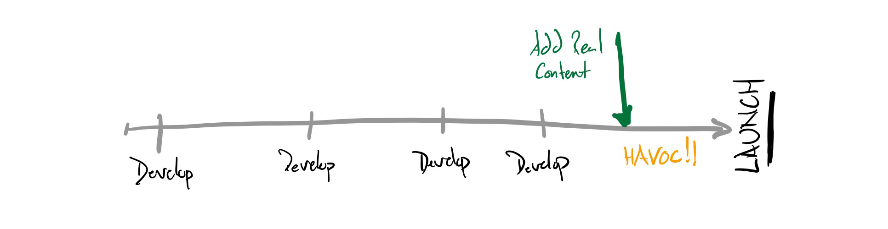
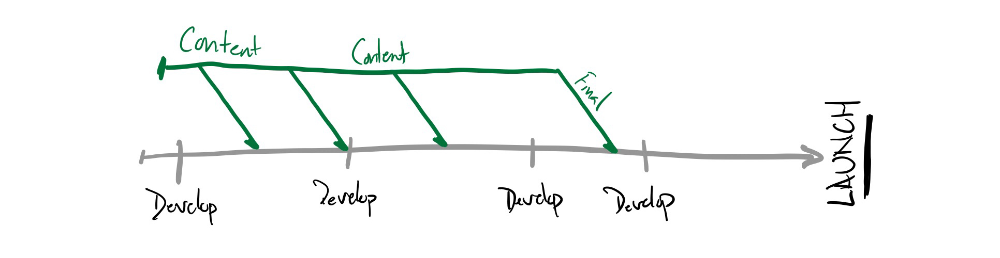

autoscale: true
build-lists: true
slidenumbers: true
footer: Pete Inge | Bluecadet | Drupal (And Maybe Wordpress) Site Content with Airtable
theme: Work, 6

# Drupal (And Maybe Wordpress) Site Content with Airtable

^ * Be the Story Teller
* Breathe

---

# Who am I?

## Pete Inge
### Tech Lead, Bluecadet

pinge@bluecadet.com
https://github.com/pingevt/drupal-airtable


^ Experience: ~10yrs freelance in web dev
Worked in D5-D8
Current: @ BC for 4.5 years
I'm a problem solver
Contact for more info

---

#Bluecadet


^ Established in 2007, Bluecadet is an Emmy Award-winning digital agency that creates world-class websites, mobile apps, interactive installations, and immersive environments. We collaborate with leading museums, cultural institutions, universities, progressive brands, and nonprofit organizations to educate, engage, and entertain.

^ Bluecadet is an experience design agency. We partner with mission-driven organizations to create a broad suite of products and environments. We embrace design, technology, and innovation in the service of content, emotion, and experience. We create experiences that engage audiences through increased knowledge, empathy, and action.

^ We don't consider ourselves a Drupal shop. We do want to use the right tool for the right job. That said, we do use Drupal, and the "other" CMS for most of our BE needs. We are slated this year to really epxplore other CMSs, but my gut is telling our websites will stay inthe Drupal sphere for quite awhile.

---

# Who is this for?

- “Site Builders”
- Moderate to Advanced Coders
- Content Creators

---

# What is Airtable?

- "Organize anything, with anyone, from anywhere"
- Spreadsheets on steroids


^ First, lets do a quick introduction to Airtable...

^ I am not an Airtable expert by any means...

---

# Why do we want to use Airtable?

- Content is typically developed / changed / altered in tandem with development
- Content in design is either "ideal" or Lorem Ipsum
- Web is typiclaly flexible, but other types of projects might not be (kiosks, etc)

^ I've never been on a project where prior to launch we haven't scrambled to a certain degree to fix designs or content.

---

# Why do we want to use Airtable?
## Typical content approach

- develop, develop, develop
- internal CMS review on minimal content
- fix, fix, fix
- client training and content entry
- develop, fix, develop, fix
- LAUNCH! :rocket:

---
[.build-lists: false]

# Why do we want to use Airtable?
## Typical content approach

- develop, develop, develop
- internal CMS review on minimal content
- fix, fix, fix
- client training and content entry
  - (Content Development starts here and is delayed due to incorrect CMS)
- develop, fix, develop, fix
- LAUNCH! :rocket:

---
[.build-lists: false]

# Why do we want to use Airtable?
## Typical content approach



---

# Why do we want to use Airtable?
## Hopefully better approach

- We want content development to start as early as possible
  - Use tools like spreadsheets, Airtable or Gather Content
- We would like to see as much real content in the CMS as quickly as we can
- We would like to not have to manually copy paste content from one of these tools to the CMS

^ Websites as well as Headless projects.

---
[.build-lists: false]

# Why do we want to use Airtable?
## Hopefully better approach



^ In order to do this however, we need to start developing our content outside of the CMS...

---

# Content
## Let's Talk Content


- Usually design with Perfect content OR Lorem Ipsum.
- 1000's of Word docs and crazy spreadsheets

^ Obviously, if we are working on a project, most projects we need to bring together content to be displayed. When a project goes through design phase we're typically using "Ideal content" or Lorem Ipsum content. I have never been on a project that has not had issues with content after we build. Whether certain words are too short/long. @ paragraphs or 60... Content is rarely IDEAL.

^ intro our use of spreadsheets, Gather content & airtable

^ decide to tackle NAB project with airtable

---

# National Association of Broadcasters (NAB)

- Touchwall of Honorees
- Headless Drupal 8 site
- Minimal/Simple Content
  - BUT we are using paragraphs for the main narrative content
- (Internally) Healthy development timeline
- Two content types
  - One would be developed in the CMS only
- Flat data
- (Internally) Healthy development timeline

^ We had plenty of time to work on this project. We wanted to use this to work on some internal goals.

^ So we decided with this project to use Airtable for our content needs. And then it came down to me to sync that content into Drupal.

---

# How to Sync?

- Contrib Modules... ?? 🤔
  - [Drupal 8 Mod: Airtable ](https://www.drupal.org/project/airtable)
- APIs to the rescue
  - Airtable API
  - Drupal Batch API

^ Module has no official release. Syncs 1:1 flat table to fields.

---

# How to Sync?
## Overview

- We want content to originate in Airtable and update (overwrite) content in the CMS
- We want a "push button" sync solution
- We need to handle Paragraphs and re-ordering
- We need to handle media: Images, Video, Audio

---

# How to Sync?
## Deep Dive


Batch API

> "Batches allow heavy processing to be spread out over several page requests, ensuring that the processing does not get interrupted because of a PHP timeout, while allowing the user to receive feedback on the progress of the ongoing operations. It also can reduce out of memory situations."
- Drupal.org

^ So lets look at some code =>

---

# How to Sync?
## Deep Dive: Code
We start with a form:

``` PHP
class AtConnContent extends FormBase {
  ...
  public function submitForm(array &$form, FormStateInterface $form_state) {
    $batch = [
      'title' => $this->t('Syncing Content'),
      'operations' => [
        [[$this, 'initiateAirtableData'], []],
        [[$this, 'processAirtableData'], []],
        [[$this, 'syncAirtableData'], []]
      ],
      'finished' => [$this, 'finishedBatchSync'],
    ];

    batch_set($batch);
  }

}
```

^ explain batch operations and finished

^ we can save data through these operations.

^ initiateAirtableData: paging throught the calls to the Airtable API to collect all my data.

^ processAirtableData: looping through all my records, and getting data from linked tables from Airtable's API.

^ syncAirtableData: Finally updating content in Drupal.

---

# How to Sync?
## Deep Dive: Code
`syncNode()` is The method to actually sync.

``` PHP

  /**
   * Sync local node with data from Airtable.
   */
  private function syncNode($data) {
    ...
  }

```

---

# How to Sync?
## Deep Dive: Code

``` PHP

  private function syncNode($data) {

    // First Check if we have an existing node.
    $query = $this->entityQuery->get('node');
    $query->condition('type', 'inductee');
    $query->condition('field_sync_id', $data->id);
    $entity_ids = $query->execute();
    ...
  }

```

^ First thing is we need to see if we already have a node for this record.

^ We use a simple text field to save an ID. We get ids from Airtable, so we just use that value.

---

# How to Sync?
## Deep Dive: Code

``` PHP
  private function syncNode($data) {
    ...
    // Create new node if it doesn't exists.
    if (empty($entity_ids)) {
      $node = Node::create([
        'type' => 'inductee',
        'status' => TRUE,
      ]);
    }
    else {
      $node_storage = $this->entityTypeManager->getStorage('node');
      $node = $node_storage->load(current($entity_ids));

      $node->setNewRevision(TRUE);
      $node->revision_log = 'Updating content from Airtable.';
      $node->setRevisionCreationTime(REQUEST_TIME);
      $node->setRevisionUserId(1);
    }
    ...
  }
```

^ We create a new node or load the exisitng node.

^ Something to note here is, I like to make revisions. All the time! There are modules out there to clean up revisions, and I would recommend them, but I like making revisions.

---

# How to Sync?
## Deep Dive: Code

``` PHP
  private function syncNode($data) {
    ...
    $node->set('title', strip_tags($data->Name[0]->Name));
    $node->set('field_sync_id', $data->id);
    $node->set('field_name', preg_replace("/\s*\r\n\s*|\s*\r\s*|\s*\n\s*/",
      '<br/>', trim($data->Name[0]->{"Story Display Name"})));
    $node->set('field_plain_name', $data->Name[0]->Name);
    ...
  }
```

^ And most fields we can simply save to the fields. Here we are doing preg replace for line breaks and replaceing them with `<br>` tags

^ So how do we handle media =>

---

# How to Sync?
## Deep Dive: Code

Files: Images, Audio, Video

``` PHP
  // Media object found or created.
  ...
  // Save actual image.
  $target_dir = 'public://media';
  $this->fileSystem->prepareDirectory($target_dir, FileSystemInterface::CREATE_DIRECTORY);

  $new_filename = bcu_transliterate_filenames_transliteration($illustration_data->filename);
  $target_dir .= "/" . $new_filename;
  $drupal_image = system_retrieve_file($illustration_data->url, $target_dir, TRUE, FILE_EXISTS_RENAME);

  if ($drupal_image) {
    $media->set('field_media_image', [
      'target_id' => $drupal_image->id(),
      'alt' => '',
    ]);
  }
  ...
```

^ Much like we did with the node we look for a media entity or we create one. I didn't include that code, b/c its pretty much the same.

^ system_retrieve_file($url, $destination = NULL, $managed = FALSE, $replace = FILE_EXISTS_RENAME)

---

# How to Sync?
## Deep Dive: Paragraph Bundles


- Detail narrative includes diffrent paragrpah elements
- We had fairly simple limits for this project
- Airtable does not easily handle ordering of Paragraph bundles
- Our process was to sync content but keep ordering saved in the CMS


---


^ explain code...
how we handled paragraphs

---

explin FE group and how they had a CMS branch (need to talk to Weili)

---

show off Big Red Button

---

How this helped with this project

---

Some gotchas and help stuff

- line breaks
- making revisions
- airtable has bad keys...

---

#Thanks!

###Questions?<br><br>Comments?<br><br>Discussion?

---

#Bluecadet


---

https://github.com/pingevt/drupal-react-widgets
https://api.drupal.org/api/examples/batch_example%21batch_example.module/group/batch_example/8.x-1.x

---


---

### People

:bowtie: :smile: :laughing: :blush: :smiley: :relaxed: :smirk: :heart_eyes: :kissing_heart: :kissing_closed_eyes: :flushed: :relieved: :satisfied: :grin: :wink: :stuck_out_tongue_winking_eye: :stuck_out_tongue_closed_eyes: :grinning: :kissing: :kissing_smiling_eyes: :stuck_out_tongue: :sleeping: :worried: :frowning: :anguished: :open_mouth: :grimacing: :confused: :hushed: :expressionless: :unamused: :sweat_smile: :sweat: :disappointed_relieved: :weary: :pensive: :disappointed: :confounded: :fearful: :cold_sweat: :persevere: :cry: :sob: :joy: :astonished: :scream: :neckbeard: :tired_face: :angry: :rage: :triumph: :sleepy: :yum: :mask: :sunglasses: :dizzy_face: :imp: :smiling_imp: :neutral_face: :no_mouth: :innocent: :alien: :yellow_heart: :blue_heart: :purple_heart: :heart: :green_heart: :broken_heart: :heartbeat: :heartpulse: :two_hearts: :revolving_hearts: :cupid: :sparkling_heart: :sparkles: :star: :star2: :dizzy: :boom: :collision: :anger: :exclamation: :question: :grey_exclamation: :grey_question: :zzz: :dash: :sweat_drops: :notes: :musical_note: :fire: :hankey: :poop: :shit: :thumbsup: :-1: :thumbsdown: :ok_hand: :punch: :facepunch: :fist: :v: :wave: :hand: :raised_hand: :open_hands: :point_up: :point_down: :point_left: :point_right: :raised_hands: :pray: :point_up_2: :clap:

---

### People cont.

:muscle: :metal: :fu: :walking: :runner: :running: :couple: :family: :two_men_holding_hands: :two_women_holding_hands: :dancer: :dancers: :ok_woman: :no_good: :information_desk_person: :raising_hand: :bride_with_veil: :person_with_pouting_face: :person_frowning: :bow: :couplekiss: :couple_with_heart: :massage: :haircut: :nail_care: :boy: :girl: :woman: :man: :baby: :older_woman: :older_man: :person_with_blond_hair: :man_with_gua_pi_mao: :man_with_turban: :construction_worker: :cop: :angel: :princess: :smiley_cat: :smile_cat: :heart_eyes_cat: :kissing_cat: :smirk_cat: :scream_cat: :crying_cat_face: :joy_cat: :pouting_cat: :japanese_ogre: :japanese_goblin: :see_no_evil: :hear_no_evil: :speak_no_evil: :guardsman: :skull: :feet: :lips: :kiss: :droplet: :ear: :eyes: :nose: :tongue: :love_letter: :bust_in_silhouette: :busts_in_silhouette: :speech_balloon: :thought_balloon: :feelsgood: :finnadie: :goberserk: :godmode: :hurtrealbad: :rage1: :rage2: :rage3: :rage4: :suspect: :trollface:

---

### Nature

:sunny: :umbrella: :cloud: :snowflake: :snowman: :zap: :cyclone: :foggy: :ocean: :cat: :dog: :mouse: :hamster: :rabbit: :wolf: :frog: :tiger: :koala: :bear: :pig: :pig_nose: :cow: :boar: :monkey_face: :monkey: :horse: :racehorse: :camel: :sheep: :elephant: :panda_face: :snake: :bird: :baby_chick: :hatched_chick: :hatching_chick: :chicken: :penguin: :turtle: :bug: :honeybee: :ant: :beetle: :snail: :octopus: :tropical_fish: :fish: :whale: :whale2: :dolphin: :cow2: :ram: :rat: :water_buffalo: :tiger2: :rabbit2: :dragon: :goat: :rooster: :dog2: :pig2: :mouse2: :ox: :dragon_face: :blowfish: :crocodile: :dromedary_camel: :leopard: :cat2: :poodle: :paw_prints: :bouquet: :cherry_blossom: :tulip: :four_leaf_clover: :rose: :sunflower: :hibiscus: :maple_leaf: :leaves: :fallen_leaf: :herb: :mushroom: :cactus: :palm_tree: :evergreen_tree: :deciduous_tree: :chestnut: :seedling: :blossom: :ear_of_rice: :shell: :globe_with_meridians: :sun_with_face: :full_moon_with_face: :new_moon_with_face: :new_moon: :waxing_crescent_moon: :first_quarter_moon: :waxing_gibbous_moon: :full_moon: :waning_gibbous_moon: :last_quarter_moon: :waning_crescent_moon: :last_quarter_moon_with_face: :first_quarter_moon_with_face: :moon: :earth_africa: :earth_americas: :earth_asia: :volcano: :milky_way: :partly_sunny: :octocat: :squirrel:

---

### Objects

:bamboo: :gift_heart: :dolls: :school_satchel: :mortar_board: :flags: :fireworks: :sparkler: :wind_chime: :rice_scene: :jack_o_lantern: :ghost: :santa: :christmas_tree: :gift: :bell: :no_bell: :tanabata_tree: :tada: :confetti_ball: :balloon: :crystal_ball: :cd: :dvd: :floppy_disk: :camera: :video_camera: :movie_camera: :computer: :tv: :iphone: :phone: :telephone: :telephone_receiver: :pager: :fax: :minidisc: :vhs: :sound: :speaker: :mute: :loudspeaker: :mega: :hourglass: :hourglass_flowing_sand: :alarm_clock: :watch: :radio: :satellite: :loop: :mag: :mag_right: :unlock: :lock: :lock_with_ink_pen: :closed_lock_with_key: :key: :bulb: :flashlight: :high_brightness: :low_brightness: :electric_plug: :battery: :calling: :email: :mailbox: :postbox: :bath: :bathtub: :shower: :toilet: :wrench: :nut_and_bolt: :hammer: :seat: :moneybag: :yen: :dollar: :pound: :euro: :credit_card: :money_with_wings: :e-mail: :inbox_tray: :outbox_tray: :envelope: :incoming_envelope: :postal_horn: :mailbox_closed: :mailbox_with_mail: :mailbox_with_no_mail: :door: :smoking: :bomb: :gun: :hocho: :pill: :syringe: :page_facing_up: :page_with_curl: :bookmark_tabs: :bar_chart: :chart_with_upwards_trend: :chart_with_downwards_trend: :scroll: :clipboard: :calendar: :date: :card_index: :file_folder: :open_file_folder: :scissors: :pushpin: :paperclip: :black_nib: :pencil2: :straight_ruler: :triangular_ruler: :closed_book: :green_book: :blue_book: :orange_book: :notebook: :notebook_with_decorative_cover: :ledger: :books: :bookmark: :name_badge: :microscope: :telescope: :newspaper: :football: :basketball: :soccer: :baseball: :tennis: :8ball: :rugby_football: :bowling: :golf: :mountain_bicyclist: :bicyclist: :horse_racing: :snowboarder: :swimmer: :surfer: :ski: :spades: :hearts: :clubs: :diamonds: :gem: :ring: :trophy:

---

### Objects cont.

:musical_score: :musical_keyboard: :violin: :space_invader: :video_game: :black_joker: :flower_playing_cards: :game_die: :dart: :mahjong: :clapper: :memo: :pencil: :book: :art: :microphone: :headphones: :trumpet: :saxophone: :guitar: :shoe: :sandal: :high_heel: :lipstick: :boot: :shirt: :tshirt: :necktie: :womans_clothes: :dress: :running_shirt_with_sash: :jeans: :kimono: :bikini: :ribbon: :tophat: :crown: :womans_hat: :mans_shoe: :closed_umbrella: :briefcase: :handbag: :pouch: :purse: :eyeglasses: :fishing_pole_and_fish: :coffee: :tea: :sake: :baby_bottle: :beer: :beers: :cocktail: :tropical_drink: :wine_glass: :fork_and_knife: :pizza: :hamburger: :fries: :poultry_leg: :meat_on_bone: :spaghetti: :curry: :fried_shrimp: :bento: :sushi: :fish_cake: :rice_ball: :rice_cracker: :rice: :ramen: :stew: :oden: :dango: :egg: :bread: :doughnut: :custard: :icecream: :ice_cream: :shaved_ice: :birthday: :cake: :cookie: :chocolate_bar: :candy: :lollipop: :honey_pot: :apple: :green_apple: :tangerine: :lemon: :cherries: :grapes: :watermelon: :strawberry: :peach: :melon: :banana: :pear: :pineapple: :sweet_potato: :eggplant: :tomato: :corn:

---

### Places

:house: :house_with_garden: :school: :office: :post_office: :hospital: :bank: :convenience_store: :love_hotel: :hotel: :wedding: :church: :department_store: :european_post_office: :city_sunrise: :city_sunset: :japanese_castle: :european_castle: :tent: :factory: :tokyo_tower: :japan: :mount_fuji: :sunrise_over_mountains: :sunrise: :stars: :statue_of_liberty: :bridge_at_night: :carousel_horse: :rainbow: :ferris_wheel: :fountain: :roller_coaster: :ship: :speedboat: :boat: :sailboat: :rowboat: :anchor: :rocket: :airplane: :helicopter: :steam_locomotive: :tram: :mountain_railway: :bike: :aerial_tramway: :suspension_railway: :mountain_cableway: :tractor: :blue_car: :oncoming_automobile: :car: :red_car: :taxi: :oncoming_taxi: :articulated_lorry: :bus: :oncoming_bus: :rotating_light: :police_car: :oncoming_police_car: :fire_engine: :ambulance: :minibus: :truck: :train: :station: :train2: :bullettrain_front: :bullettrain_side: :light_rail: :monorail: :railway_car: :trolleybus: :ticket: :fuelpump: :vertical_traffic_light: :traffic_light: :warning: :construction: :beginner: :atm: :slot_machine: :busstop: :barber: :hotsprings: :checkered_flag: :crossed_flags: :izakaya_lantern: :moyai: :circus_tent: :performing_arts: :round_pushpin: :triangular_flag_on_post: :jp: :kr: :cn: :us: :fr: :es: :it: :ru: :gb: :uk: :de:

---

### Symbols

:one: :two: :three: :four: :five: :six: :seven: :eight: :nine: :keycap_ten: :1234: :zero: :hash: :symbols: :arrow_backward: :arrow_down: :arrow_forward: :arrow_left: :capital_abcd: :abcd: :abc: :arrow_lower_left: :arrow_lower_right: :arrow_right: :arrow_up: :arrow_upper_left: :arrow_upper_right: :arrow_double_down: :arrow_double_up: :arrow_down_small: :arrow_heading_down: :arrow_heading_up: :leftwards_arrow_with_hook: :arrow_right_hook: :left_right_arrow: :arrow_up_down: :arrow_up_small: :arrows_clockwise: :arrows_counterclockwise: :rewind: :fast_forward: :information_source: :ok: :twisted_rightwards_arrows: :repeat: :repeat_one: :new: :top: :up: :cool: :free: :ng: :cinema: :koko: :signal_strength: :u5272: :u5408: :u55b6: :u6307: :u6708: :u6709: :u6e80: :u7121: :u7533: :u7a7a: :u7981: :sa: :restroom: :mens: :womens: :baby_symbol: :no_smoking: :parking: :wheelchair: :metro: :baggage_claim: :accept: :wc: :potable_water: :put_litter_in_its_place: :secret: :congratulations: :m: :passport_control: :left_luggage: :customs: :ideograph_advantage: :cl: :sos: :id: :no_entry_sign: :underage: :no_mobile_phones: :do_not_litter: :non-potable_water: :no_bicycles: :no_pedestrians: :children_crossing: :no_entry: :eight_spoked_asterisk: :eight_pointed_black_star: :heart_decoration: :vs: :vibration_mode: :mobile_phone_off: :chart: :currency_exchange: :aries: :taurus: :gemini: :cancer: :leo: :virgo: :libra: :scorpius: :sagittarius: :capricorn: :aquarius: :pisces: :ophiuchus: :six_pointed_star:

---

### Symbols cont.

:negative_squared_cross_mark: :a: :b: :ab: :o2: :diamond_shape_with_a_dot_inside: :recycle: :end: :on: :soon: :clock1: :clock130: :clock10: :clock1030: :clock11: :clock1130: :clock12: :clock1230: :clock2: :clock230: :clock3: :clock330: :clock4: :clock430: :clock5: :clock530: :clock6: :clock630: :clock7: :clock730: :clock8: :clock830: :clock9: :clock930: :heavy_dollar_sign: :copyright: :registered: :tm: :x: :heavy_exclamation_mark: :bangbang: :interrobang: :o: :heavy_multiplication_x: :heavy_plus_sign: :heavy_minus_sign: :heavy_division_sign: :white_flower: :100: :heavy_check_mark: :ballot_box_with_check: :radio_button: :link: :curly_loop: :wavy_dash: :part_alternation_mark: :trident: :black_square: :white_square: :white_check_mark: :black_square_button: :white_square_button: :black_circle: :white_circle: :red_circle: :large_blue_circle: :large_blue_diamond: :large_orange_diamond: :small_blue_diamond: :small_orange_diamond: :small_red_triangle: :small_red_triangle_down: :shipit:
