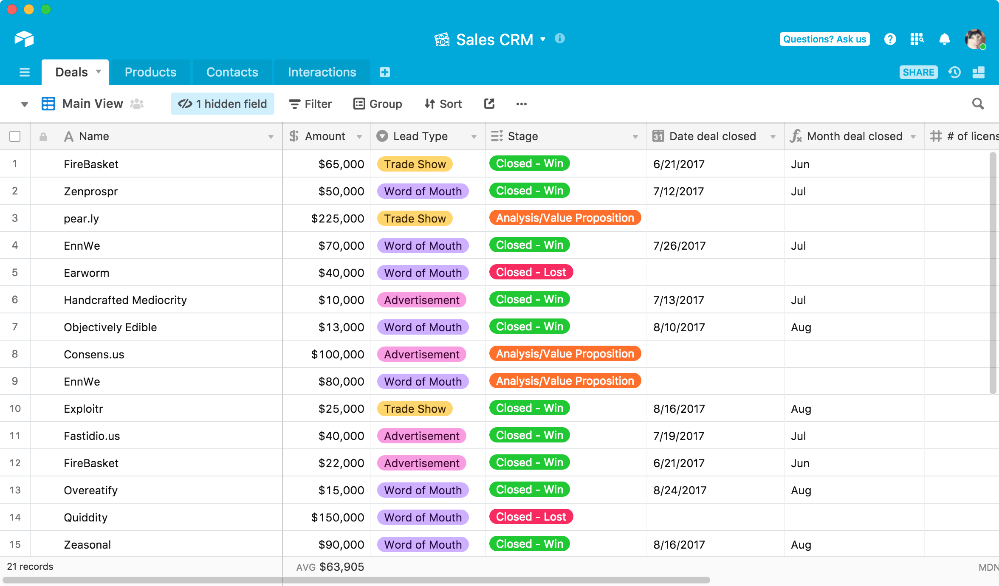
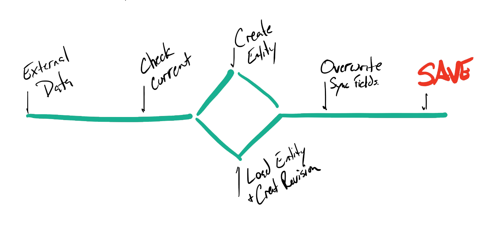
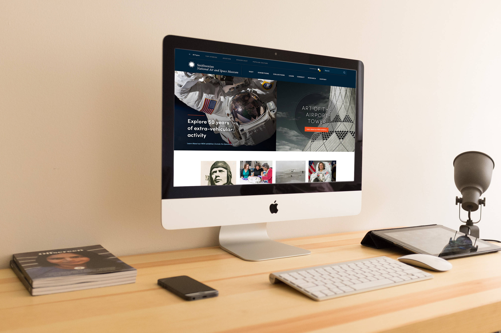

autoscale: true
build-lists: true
slidenumbers: true
footer: Pete Inge | Bluecadet | Drupal (And Maybe Wordpress) Site Content with Airtable
theme: Work, 6

# Drupal (And Maybe Wordpress) Site Content with Airtable

^ * Be the Story Teller
* Breathe

___

# Who am I?

## Pete Inge
### Tech Lead, Bluecadet

pinge@bluecadet.com
https://github.com/pingevt/drupal-airtable


^ Experience: ~10yrs freelance in web dev
Worked in D5-D8
Current: @ BC for 4.5 years
I'm a problem solver
Contact for more info

___

#Bluecadet


^ Established in 2007, Bluecadet is an Emmy Award-winning digital agency that creates world-class websites, mobile apps, interactive installations, and immersive environments. We collaborate with leading museums, cultural institutions, universities, progressive brands, and nonprofit organizations to educate, engage, and entertain.

^ Bluecadet is an experience design agency. We partner with mission-driven organizations to create a broad suite of products and environments. We embrace design, technology, and innovation in the service of content, emotion, and experience. We create experiences that engage audiences through increased knowledge, empathy, and action.

^ We don't consider ourselves a Drupal shop. We do want to use the right tool for the right job. That said, we do use Drupal, and the "other" CMS for most of our BE needs. We are slated this year to really explore other CMSs, but my gut is telling our websites will stay in the Drupal sphere for quite awhile.

___
[.build-lists: false]

# Who is this for?

- "Site Builders"
- Moderate to Advanced Coders
- Content Creators
- Anyone concerned with content

^ We will get into code... but good to see.

^ => So lets get started... What is Airtable?

___

# What is Airtable?

- "Organize anything, with anyone, from anywhere"
  - On-line collaboration
- Spreadsheets on steroids



^ First, lets do a quick introduction to Airtable...

^ online collaboration

^ I am not an Airtable expert by any means...

^ Not meant to be permanent.

^ => Why should we care about our content development?

___
[.build-lists: false]
# What is Airtable?

- "Organize anything, with anyone, from anywhere"
  - On-line collaboration
- Spreadsheets on steroids

<br><br><br>
Let's take a look =>


^ First, lets do a quick introduction to Airtable...

^ online collaboration

^ I am not an Airtable expert by any means...

^ Not meant to be permanent.

^ => Why should we care about our content development?

___
[.build-lists: false]
# Why should we care about content development?


- Content is typically developed / changed / altered in tandem with development
- In design, content is either _ideal_ or _Lorem Ipsum_
- Web is typically flexible, but other types of projects might not be (kiosks, etc)

^ Ideal meaning perfect character counts, etc.

^ I've never been on a project where prior to launch we haven't scrambled to a certain degree to fix designs or content.

^ => Lets take a look at two approaches to content

___

# Why should we care about content development?
## Typical content approach

- develop, develop, develop
- internal CMS review on minimal content
- fix, fix, fix
- client training and content entry
- develop, fix, develop, fix
- LAUNCH! :rocket:

^ => GO

___
[.build-lists: false]

# Why should we care about content development?
## Typical content approach

- develop, develop, develop
- internal CMS review on minimal content
- fix, fix, fix
- client training and content entry
  - (Content Development starts here and is delayed due to issues in CMS)
- develop, fix, develop, fix
- LAUNCH! :rocket:

^ => Lets look at this visually

___

# Why should we care about content development?
## Typical content approach


^ To visualize this...

^ Content development is completely separate or worse starts at this point and finally enters close to LAUNCH or deadline.

___

# Why should we care about content development?
## What we want in a better approach

- We want content development to start as early as possible
  - Use tools like spreadsheets, Airtable or Gather Content
- We would like to see as much real content in the CMS as quickly as we can
- We would like to not have to manually copy paste content from one of these tools to the CMS

^ Websites as well as Headless projects.

___
[.build-lists: false]

# Why should we care about content development?
## What we want in a better approach


^ In order to do this however, we need to start developing our content outside of the CMS... and merge it in when we can. Just like we do with code and features.

^ => Lets intro NAB

___

# National Association of Broadcasters (NAB)

![right] (media/dev-wall.jpg)

- Touch wall of Honorees
- Headless Drupal 8 site
- Minimal/Simple Content

___

# National Association of Broadcasters (NAB)

![right 70%] (media/detail.png)

- Two content types
  - One would be developed in the CMS only
- Flat data
- Using paragraphs for the main narrative content
- (Internally) Healthy development time-line for the CMS

^ We had plenty of time to work on this project. We wanted to use this to work on some internal goals.

^ So we decided with this project to use Airtable for our content needs. And then it came down to me to sync that content into Drupal.

^ => Quick peak at our airtable

___

# NAB: Airtable


^ Here is just a quick glimpse at two of our tables.

^ I would take a little bit of time to think about and organize organize your tables properly.

^ => So how do we start syncing this

___

# How to Sync?
## Planning: assets

- Contrib Modules... ?? 🤔
  - [Drupal 8 Mod: Airtable ](https://www.drupal.org/project/airtable)
- APIs to the rescue
  - Airtable API
  - Drupal Batch API

^ Module has no official release. Syncs 1:1 flat table to fields.

^ => Lets look at constraints...

___

# How to Sync?
## Planning: constraints

- We want content to originate in Airtable and update (overwrite) content in the CMS
  - Not nuke and rebuild
- We want a "push button" sync solution
- We want to handle Paragraphs content in Airtable and ordering of bundles in Drupal
- We want to handle media: Images, Video, Audio
- We eventually want to turn off the sync

^ Overview of how we want this to work.

^ => lets dive into the code.

___
[.footer: ]


^ Airtable API response object from Postman.

___

# How to Sync?
## Deep Dive


Batch API

> "Batches allow heavy processing to be spread out over several page requests, ensuring that the processing does not get interrupted because of a PHP timeout, while allowing the user to receive feedback on the progress of the ongoing operations. It also can reduce out of memory situations."
- Drupal.org

^ So lets look at some code =>

___

# How to Sync?
## Deep Dive: Code



^ Reuse this process for everything...

^ If we were doing 2-way sync we would need to delete content not in this dataset.

^ => We need to setup our loop to do this. Lets take a look.

___

# How to Sync?
## Deep Dive: Code
We start with a form:

``` PHP
class AtConnContent extends FormBase {
  ...
  public function submitForm(array &$form, FormStateInterface $form_state) {
    ...
    $batch = [
      'title' => $this->t('Syncing Content'),
      'operations' => [
        [[$this, 'initiateAirtableData'], []],
        [[$this, 'processAirtableData'], []],
        [[$this, 'syncAirtableData'], []]
      ],
      'finished' => [$this, 'finishedBatchSync'],
    ];

    batch_set($batch);
  }

}
```

^ explain batch operations and finished

^ we can save data through these operations.

^ initiateAirtableData: paging through the calls to the Airtable API to collect all my data.

^ processAirtableData: looping through all my records, and getting data from linked tables from Airtable's API.

^ syncAirtableData: Finally updating content in Drupal.

___

# How to Sync?
## Deep Dive: Code
`syncNode()` is The method to actually sync.

``` PHP

  /**
   * Sync local node with data from Airtable.
   */
  private function syncNode($data) {
    ...
  }

```

___

# How to Sync?
## Deep Dive: Code

``` PHP

  private function syncNode($data) {

    // First Check if we have an existing node.
    $query = $this->entityQuery->get('node');
    $query->condition('type', 'inductee');
    $query->condition('field_sync_id', $data->id);
    $entity_ids = $query->execute();
    ...
  }

```

^ First thing is we need to see if we already have a node for this record.

^ We use a simple text field to save an ID. We get ids from Airtable, so we just use that value.

___

# How to Sync?
## Deep Dive: Code

``` PHP
  private function syncNode($data) {
    ...
    // Create new node if it doesn't exists.
    if (empty($entity_ids)) {
      $node = Node::create([
        'type' => 'inductee',
        'status' => TRUE,
      ]);
    }
    else {
      $node_storage = $this->entityTypeManager->getStorage('node');
      $node = $node_storage->load(current($entity_ids));

      $node->setNewRevision(TRUE);
      $node->revision_log = 'Updating content from Airtable.';
      $node->setRevisionCreationTime(REQUEST_TIME);
      $node->setRevisionUserId(1);
    }
    ...
  }
```

^ We create a new node or load the existing node.

^ Something to note here is, I like to make revisions. All the time! There are modules out there to clean up revisions, and I would recommend them, but I like making revisions.

___

# How to Sync?
## Deep Dive: Code

``` PHP
  private function syncNode($data) {
    ...
    $node->set('title', strip_tags($data->Name[0]->Name));
    $node->set('field_sync_id', $data->id);
    $node->set('field_name', preg_replace("/\s*\r\n\s*|\s*\r\s*|\s*\n\s*/",
      '<br/>', trim($data->Name[0]->{"Story Display Name"})));
    $node->set('field_plain_name', $data->Name[0]->Name);
    ...
  }
```

^ And most fields we can simply save to the fields. Here we are doing preg replace for line breaks and replacing them with `<br>` tags

^ => So how do we handle media

___

# How to Sync?
## Deep Dive: Code

Files: Images, Audio, Video

``` php
  // Media object found or created.
  ...
  // Save actual image.
  $target_dir = 'public://media';
  $this->fileSystem->prepareDirectory($target_dir, FileSystemInterface::CREATE_DIRECTORY);

  $new_filename = bcu_transliterate_filenames_transliteration($illustration_data->filename);
  $target_dir .= "/" . $new_filename;
  $drupal_image = system_retrieve_file($illustration_data->url, $target_dir, TRUE, FILE_EXISTS_RENAME);

  if ($drupal_image) {
    $media->set('field_media_image', [
      'target_id' => $drupal_image->id(),
      'alt' => '',
    ]);
  }
  ...
```

^ Much like we did with the node we look for a media entity or we create one. I didn't include that code, b/c its pretty much the same.

^ system\_retrieve\_file($url, $destination = NULL, $managed = FALSE, $replace = FILE_EXISTS_RENAME)

^ => Let's get into the Paragraph bundles...

___

# How to Sync?
## Deep Dive: Paragraph Bundles


- Detail narrative includes different paragraph elements
- We had fairly simple limits for this project
- Airtable does not easily handle ordering of Paragraph bundles
- I personally added the ability to add Paragraphs, that won't get effected by the sync
- Our process was to sync content but keep ordering saved in the CMS

___

# How to Sync?
## Deep Dive: Code

``` php

  private function syncNode($data) {
    ...
    $new_segment_data = [];

    $this->handleQuoteText($data, $node, $new_segment_data);
    $this->handleDescriptiveText($data, $node, $new_segment_data);
    $this->handleMedia($data, $node, $new_segment_data);

    $this->handleSegmentBundles($node, $new_segment_data);
    ...
  }

```

^ Save data to create paragraphs.

___

# How to Sync?
## Deep Dive: Code

``` php
  // Example object.
  $new_segment_data[$sync_id] = [
    'type' => 'quote',
    'field_sync_id' => $sync_id,
    'field_text' => $data->Name[0]->{$field_name},
    'field_attribution' => $data->Name[0]->{'Attribution'},
  ];
```

^ Save data to create paragraphs. We have the field values, but not the paragraph entity.

___

# How to Sync?
## Deep Dive: Code

``` php
  private function handleSegmentBundles(&$node, $new_segment_data) {
    $current_bundles = $node->field_segments->referencedEntities();
    $new_bundles = [];

    ...
  }

```

^ Now process paragraphs...

^ Grab current paragraphs... and we now have two arrays of data, Current Bundles, and array of new data.
And a third which will be our new field values...
Current Bundles we pull from the node.
new data is passed into the function.

___

# How to Sync?
## Deep Dive: Code

``` php
  private function handleSegmentBundles(&$node, $new_segment_data) {
    ...
    foreach ($current_bundles as $c_bundle) {
      // Update bundle if it exists.
      // Save bundle to create new revision.
      // Remove from $new_segment_data
      ...
      $new_bundles[] = [
        'target_id' => $c_bundle->id(),
        'target_revision_id' => $c_bundle->getRevisionId(),
      ];
    }

  }

```

^ Now process paragraphs...

^ Grab current paragraphs... and we now have two arrays of data, Current Bundles, and array of new data.
And a third which will be our new field values...
Current Bundles we pull from the node.
new data is passed into the function.

^ We loop through Current bundles and update... and remove from the new data array.

^ Once this is done, we have

___

# How to Sync?
## Deep Dive: Code

``` php
  private function handleSegmentBundles(&$node, $new_segment_data) {
    ...
    foreach ($current_bundles as $c_bundle) {
      ...
    }

    // Add new segments at end of list.
    foreach ($new_segment_data as $nsd) {
      // Add new segment para.
      $para = Paragraph::create($nsd);
      $para->save();

      $new_bundles[] = [
        'target_id' => $para->id(),
        'target_revision_id' => $para->getRevisionId(),
      ];
    }

  }

```

___

# How to Sync?
## Deep Dive: Code

``` php
  private function handleSegmentBundles(&$node, $new_segment_data) {
    ...
    foreach ($current_bundles as $c_bundle) {
      ...
    }

    foreach ($new_segment_data as $nsd) {
      ...
    }

    // Save new field values.
    $node->set('field_segments', $new_bundles);
  }

```

^ => Lets recap one more time.

___

# How to Sync?
## Deep Dive: Code

- Loop through current bundles and update if necessary
- Save Paragraphs for new revision ID
- Add to the end of the field any new bundles
- This Achieves:
  - Keeps order in place,
  - Keeps any bundles that have been manually added.


^ Didn't necessarily need it for this project, but wanted it for future possibilities.

^ => How does this help with Content

___

# How this helps with content entry

- We could enter the content in Airtable as we received it, all in one place
- It can be an easier interface than Google Sheets
- There are multiple ways to enter content (rows vs cards)
- We can break up content onto separate sheets according to the content type or task and link them (instead of having 1 really big sheet).
- Linked fields can auto-populate content (less copy and pasting)

^ From our content team.

^ => How does this help with DEV

___

# How this helped with development

- The "wall" dev team was able to easily see some real content very early on and flag issues
  - A lot of inductees had really long titles which needed to be addressed
- We identified issues with data entry before it became critical
- We were able to polish our CMS => Data => Cinder Pipeline in a timely manner
  - Not 2 hours before a deadline

^ developing in cinder.

___

# Some gotchas and help stuff

- Heavier CMS Dev lift upfront
- Line breaks
- Airtable has bad keys...
- Making revisions

___

#Thanks!

###Questions?<br><br>Comments?<br><br>Discussion?

___

#Bluecadet




___

https://github.com/pingevt/drupal-react-widgets
https://api.drupal.org/api/examples/batch\_example%21batch\_example.module/group/batch_example/8.x-1.x

___
